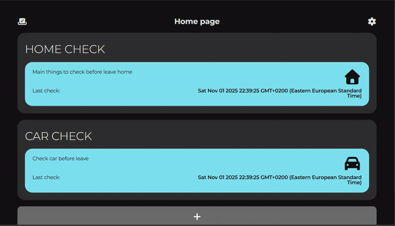

# Vue 3 + TypeScript + Vite + Pinia

This template should help get you started developing with Vue 3 and TypeScript in Vite. The template uses Vue 3 `<script setup>` SFCs, check out the [script setup docs](https://v3.vuejs.org/api/sfc-script-setup.html#sfc-script-setup) to learn more.

Learn more about the recommended Project Setup and IDE Support in the [Vue Docs TypeScript Guide](https://vuejs.org/guide/typescript/overview.html#project-setup).

## Project description

The project was made so that before leaving the house it would be possible to check that certain things had been checked.

## Media

## ✅ Features Roadmap

### 🎯 Core Functionality

- [x] Track single-time checks (door, stove, windows, etc.)
- [ ] Timestamp each check
- [ ] Add custom check items
- [ ] Optional photo proof for each check
- [ ] Offline mode support (PWA cache)
- [ ] Mark checklist as “All done” before leaving

### 🎨 UI/UX

- [ ] Clean, minimalist interface
- [x] Icon support for each checklist item
- [ ] Dark mode toggle
- [ ] Animations or calming feedback (e.g., ✅ when done)
- [ ] Customize check order or grouping (e.g., “Kitchen”, “Living room”)

### 🔔 Notifications & Reminders

- [ ] Set reminder before leaving home
- [ ] Notification if checklist isn't completed
- [ ] Daily streak tracking (to motivate habit-building)

### 🔐 Privacy & Storage

- [ ] Local storage for user data
- [ ] App lock (PIN / Face ID)
- [ ] Auto-delete photos after 24h (optional)
- [ ] Export checklist history (CSV / JSON)

### 📲 PWA Support

- [ ] Installable as PWA
- [ ] Custom app icon and splash screen
- [ ] Background sync (for future features)
- [ ] Push notifications

### 🌍 Internationalization

- [ ] Multilanguage support (EN / RU)
- [ ] Date/time localization

---

### 🚧 Future Ideas

- [ ] After component mount we have empty list of files ( undefined )
- [ ] Voice input for checks
- [ ] Smart suggestions based on day/time
- [ ] Sync across devices (via optional login)
- [ ] Integration with smart home (e.g., detect stove/power status)

### 🚧 Current tasks
- [x] Show fitered items to check
- [x] Setup routing to show correct filtered items
- [x] Add plus button for feature functionality
- [x] Save checked category and show as checked
- [ ] Add prettier